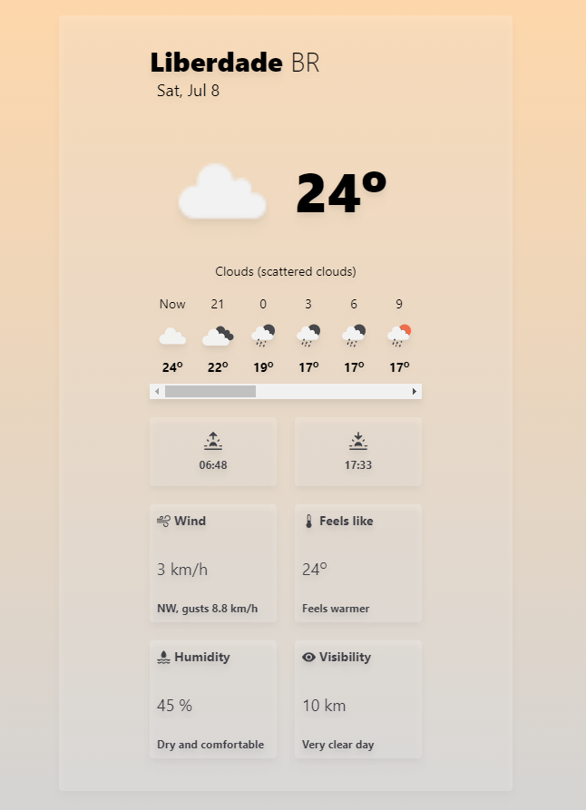

<h1 align="center"> Waether App</h1>

 

  
  ## 💻 Projeto

WaetherApp é um aplicativo para web que mostra em tempo real as condições climáticas através da API da [Openweathermap](https://openweathermap.org/).

## 🚀 Tecnologias

Esse projeto foi desenvolvido com as seguintes tecnologias:

 TypeScript e Tailwind 
 ReactJs e Vite 
 Git e Github

  
  ## 📝 Como usar

1. Clonar repositório
``git clone https://github.com/WagnerSousaLima/WeatherApp ``

2. Instalar dependências
``yarn`` ou ``npm i``

3. Subir projeto Local
``yarn dev`` ou ``npm run dev``

4. Acessar projeto
``http://localhost:5173/``

 

